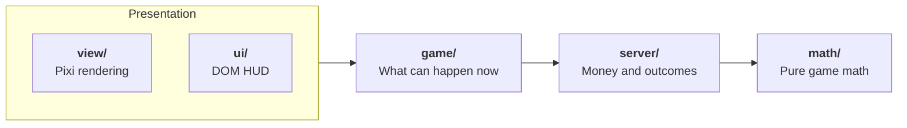
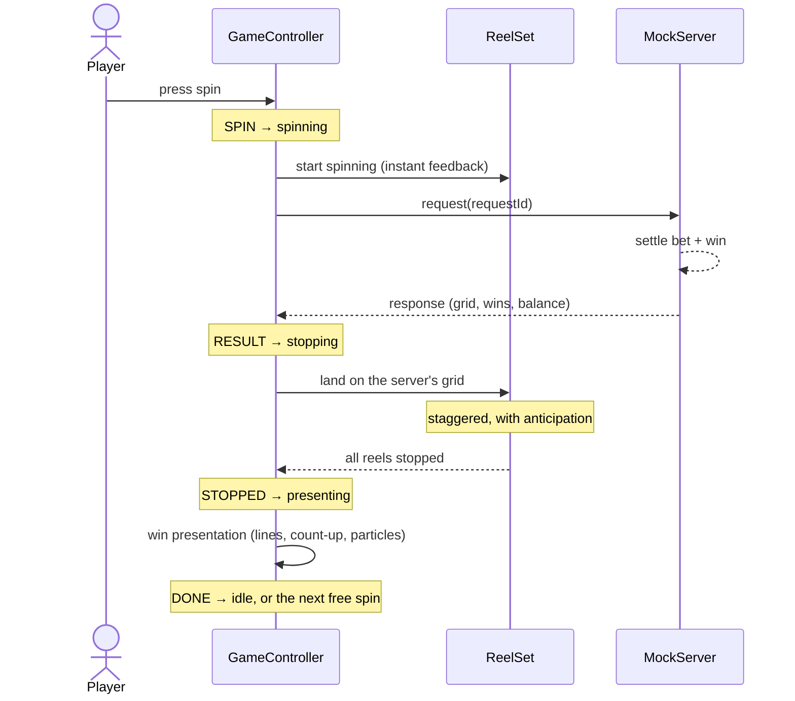

# Aurora Reels

A small, server-authoritative 5×3 slot built with **PixiJS 8 + TypeScript**.

The graphics are deliberately simple. The focus is on the parts that matter
in a real slot: a clean split between math, server and client, a verified
RTP, robust round flow, and a renderer that stays smooth on mobile.

```bash
npm install
npm run dev        # play at http://localhost:5173
npm run demo       # production build at http://localhost:4173
npm run dev:phone  # expose on your LAN to play on a phone
npm test           # unit tests
npm run simulate   # 1M-spin RTP report
npm run build      # typecheck + production build
```

## Features

- 5×3 reels, 10 paylines, wilds, scatter-triggered free spins with retriggers
- **Free spins** on their own reel strips with an x5 multiplier
- **Bonus buy** priced from simulation, so it returns about the same RTP as the base game
- **Anticipation**: extra suspense on the last reels when a bonus is one scatter away
- **Slam stop** and **skip**: one button spins, stops and skips
- **Turbo** mode, which is on by default with `prefers-reduced-motion`
- Session timer and net result, always visible (responsible gambling)
- Keyboard and screen-reader support through a DOM HUD. Space always
  spins or stops, even when another control has focus, and Enter activates
  the focused control.

## Architecture

The code is split into five layers. **Dependencies point one way only**: each
layer imports only from the layers to its right.



The math has no idea it runs in a browser. That is why the simulator and the
tests use the exact same code as the game.

The game never imports the view. Instead, `game/ports.ts` declares what it
needs (reels, win presenter, HUD, clock), and `view/` and `ui/` implement
those interfaces.

| Layer | Owns | Key files |
| --- | --- | --- |
| **`math/`** | Pure game math. No DOM, no Pixi, no async. | `rng.ts` seeded PRNG behind an `Rng` interface<br/>`config.ts` paytable, lines, reel strips, bonus rules<br/>`engine.ts` drawStops → grid → evaluate → `SpinOutcome` |
| **`server/`** | Money and outcomes. | `protocol.ts` the client–server contract (`GameApi`, requests, errors)<br/>`mockServer.ts` validation, balance, bonus state, idempotency<br/>`client.ts` retry with backoff and the same request id |
| **`game/`** | What can happen now. | `stateMachine.ts` idle → spinning → stopping → presenting → idle<br/>`GameController.ts` sequences server, state machine and views<br/>`ports.ts` the interfaces the views implement |
| **`view/`** | How it looks. Pixi only. | `Reel.ts`, `ReelSet.ts`, `WinPresenter.ts`, `ParticlePool.ts`, `symbolTextures.ts`, `tween.ts` |
| **`ui/`** | DOM HUD and perf overlay. | `hud.ts`, `perfOverlay.ts` |
| **`scripts/`** | Monte Carlo RTP report. | `simulate.ts` |
| **`tests/`** | Math, server and state machine tests. | `engine.test.ts`, `server.test.ts`, `stateMachine.test.ts` |

### Round flow



## Math

`npm run simulate` output (1M spins, seed 1):

| Metric | Value |
| --- | --- |
| RTP | ~96% (≈65% base game, ≈31% free spins) |
| Hit rate | ~30% |
| Bonus frequency | ~1 in 230 spins |
| Average bonus | ~74× bet |
| Bonus buy | 77× bet → ~96% RTP |

There is also an RTP regression test with a fixed seed. If a paytable or
reel strip change moves the RTP out of its band, CI fails.

## Decisions and trade-offs

**The server decides, the client presents.** The client never draws an
outcome. That is what regulators require. It also means the reel animation
can be anything, as long as it lands on the grid it was given.

**Money is integer cents.** Bet levels are multiples of the line count, so
every line win is a whole number of cents. There is no floating-point
rounding anywhere in the money path.

**Idempotent rounds.** Every request carries a client-generated id. If a
response is lost after the server has settled the round, the client retries
with the same id and gets the same result, so it is never charged twice.
Reusing an id for a different bet or round type is rejected. Business errors (for example insufficient funds) are never retried. You can
try it with `?fail=0.5`.

**An explicit state machine.** Events that are not valid in the current
state are ignored. Any in-flight state can fail into `error`, so even an
unexpected exception mid-round recovers to `idle`. Double taps, a spin press during a bonus buy, or a late
server response cannot put the game in a broken state.

**Reels start before the server answers.** This hides latency. A minimum
spin time keeps fast responses readable, and slam stop cuts it short.

**Reels recycle 4 sprites each.** Each reel is a float `position`, and each
sprite's slot is `(position + i) mod 4`. To land on a result, the stop tween
always travels at least one full cycle. Every sprite wraps once and picks up
its final texture on the wrap. A final `settle()` makes slam stops land
exactly right too.

**Symbols are baked into textures once.** Graphics and Text are rendered to
textures at startup. The reels are plain sprites, which batch into very few
draw calls.

**The particle pool is fixed-size.** 400 sprites are created up front. A big
win never allocates or triggers GC mid-animation. If the pool runs out,
particles are skipped rather than created.

**Frame time is capped.** Device pixel ratio is capped at 2. The delta time
is clamped at 50 ms, so a backgrounded tab does not jump when it comes back.
The perf overlay (`?perf` or press P) shows the worst frame time, not just
the average FPS.

**The HUD is DOM, not canvas.** This gives real buttons, focus states,
screen-reader labels, crisp text at any scale, and a live region that
announces wins.

**One tween clock.** Every animation and pause runs on the Pixi ticker
through `Tweens`. That is why skip, turbo and slam can act on everything in
one place.

### What I left out, and why

- **Real assets and spine animations.** They would not change the
  architecture, and time was better spent elsewhere.
- **Sound.** A production game needs it, and this is the first thing I would
  add, using an audio sprite with the Web Audio API.
- **A real backend.** `MockServer` already has the shape of one: async
  calls, errors, latency and idempotency. The contract lives in
  `server/protocol.ts`, so swapping it out means a new `GameApi`
  implementation, not a change to the game.

## Next steps (if this were a product)

1. **Unfinished round recovery.** If a response is lost and every retry
   fails, the server has settled a round the player never saw. On
   reconnect, the server should return the last round, and the client should
   replay it before continuing. Today the client only re-syncs the balance.
2. **A certified RNG** on the server side, with round history for audit.
3. **Jurisdiction config**: minimum spin time, turbo and bonus buy allowed or
   not, and reality-check intervals (for example, turbo is not allowed in
   the UK).
4. **Asset loading**: texture atlases, a loading screen with progress, and
   lazy-loaded bonus assets.
5. **Visual regression tests** on fixed seeds, plus a device performance
   budget in CI.

## Debug URL parameters

| Param | Effect |
| --- | --- |
| `?seed=42` | Replays the exact same session |
| `?fail=0.3` | Loses 30% of server responses (retries kick in) |
| `?latency=800` | Makes the server slower |
| `?balance=500` | Sets the start balance in cents |
| `?perf` | Shows the perf overlay (or press P) |
